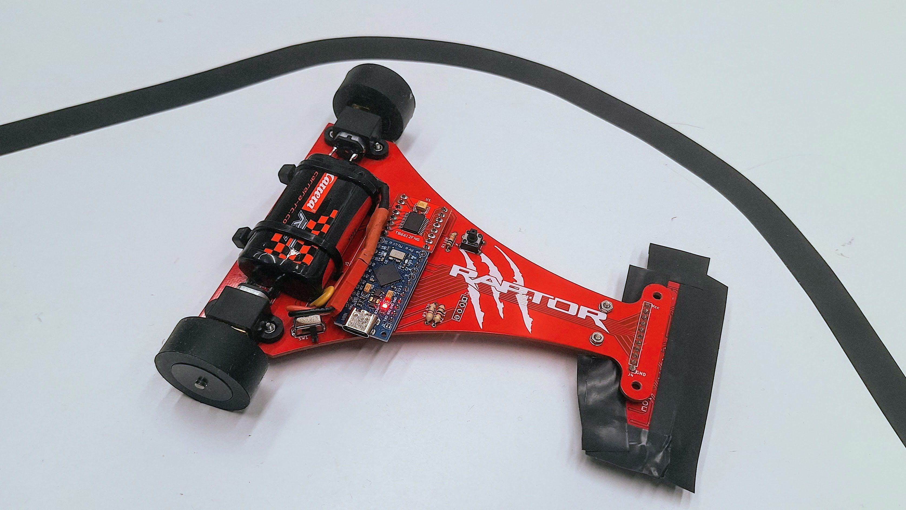

# Rap2

Rap2 is a line-following robot that is based on the [Raptor](https://github.com/felixstdp/raptor) v2.0, originally designed by [felixstdp](https://bricolabs.cc/wiki/user/felixstdp) and [salvari](https://github.com/salvari).

In terms of hardware, Rap2 is an exact clone of the original Raptor. However, it opts for more cost-effective components rather than high-end ones.

The [software](rap2.ino) for Rap2 has been written from scratch, without relying on any libraries. The focus is on a simple and minimalistic approach, which aids in learning the basics of sensor reading and PID adjustment.

# References

- [BricoLabs Raptor Project](https://bricolabs.cc/wiki/proyectos/raptor)
- [Original Raptor GitHub Repository](https://github.com/felixstdp/raptor)
